# 크로스 플랫폼 프레임워크 기반의 유명인물 영상 분석 서비스

## 1. 목표와 기능

### 1.1 목표

우선, 서비스는 사람들이 알고 접하는 것이 중요합니다. 이를 위해 먼저, 유명인물 영상 분석 서비스로 미국 대통령들과 후보를 유명 인물로 선정하여 미국 선거 관리위원회 및 기타 단체에 제공하고, 우리의 프로젝트를 알릴 수 있는 기회를 얻을 수 있습니다. 추가로 투표율과 관심도를 올릴 수 있는 효과를 낼 수 있습니다.

### 1.2 기능

- 유사도 측정 기능 : 사용자가 업로드한 인물 사진 간의 유사도를 측정하여 결과를 제공.
- 유명인물 탐색 및 정보 제공 기능 : 사용자가 업로드한 사진에서 유명 인물을 탐색하고 관련 정보를 제공.
- 두 기능을 통한 결과 AI 답글 기능
- 커뮤니티 및 상호 작용 기능

### 1.3 팀 구성
<table>
   <tr>
      <th>박상준</th>
      <th>조하나</th>
      <th>이예은</th>
      <th>강유화</th>
   </tr>
   <tr>
      <td></td>
      <td></td>
      <td></td>
      <td></td>
   </tr>
</table>

## 2.1 개발 환경

### 하드웨어 사양

- CPU: Intel Core i7-4770 @ 3.40GHz
- RAM: 16GB
- GPU: 내장 그래픽 (Intel UHD 630)

### 운영체제(OS)

- Windows 10 Home (64비트, 22H2)

### IDE 및 개발도구

- IDE: VSCode
- AI 및 데이터 분석 도구: Google Colab

### 사용 언어

- Frontend: HTML, CSS, JavaScript (JS)
- Backend 및 AI: Python

### Frontend

- JS Library: jQuery
- CSS Framework: Bootstrap

### Backend

- Web Server: NGINX
- WSGI Server: gunicorn
- WAS (Python Web Framework): Django, DBT, FastAPI
- DB: PostgreSQL

### AI 모델 및 데이터 분석

- Python 라이브러리: OpenCV, TensorFlow, PyTorch, ultralytics, MTCNN 등
- AI 모델: YOLO, MTCNN, ResNet34 등

### 배포환경

- 플랫폼: AWS Lightsail
- 운영체제: Ubuntu 가상머신 (EC2)

### 형상관리

- Git, GitHub

## 2.2 배포 URL

- [도메인은 추후 추가 예정](http://3.34.71.98/)
- 테스트용 계정
  ```
  id : testID
  pw : 0!Code2024
  ```

## 2.3 URL 구조 (모놀리식)

### common

| URL             | View                  | HTML File Name  | Note         |
|-----------------|-----------------------|-----------------|--------------|
| `/`             | IndexView             | `index.html`    | 인덱스 화면  |
| `login`         | CustomLoginView       | `login.html`    | 로그인       |
| `logout`        | auth_views.LogoutView | Null            | 로그아웃     |
| `signup`        | SignupView            | `signup.html`   | 회원가입     |
| handler404      | page_not_found        | `404.html`      | 404 페이지   |

### similarity

| URL                                     | View                           | HTML File Name        | Note         |
|-----------------------------------------|--------------------------------|-----------------------|--------------|
| `similarity/post/create/`               | SimilarityPostCreateView       | `question_form.html`  | 게시물 작성  |
| `similarity/post/read/<int:pk>/`        | SimilarityPostReadView         | `question_list.html`  | 게시물 읽기  |
| `similarity/post/update/<int:pk>/`      | SimilarityPostUpdateView       | `question_form.html`  | 게시물 수정  |
| `similarity/post/delete/<int:pk>/`      | SimilarityPostDeleteView       | Null                  | 게시물 삭제  |
| `similarity/post/vote/<int:pk>/`        | SimilarityPostVoteView         | Null                  | 게시물 추천  |
| `similarity/post/list/`                 | SimilarityPostListView         | `question_form.html`  | 게시물 목록  |
| `similarity/comment/create/<int:pk>/`   | SimilarityCommentCreateView    | Null                  | 댓글 작성    |
| `similarity/comment/update/<int:pk>/`   | SimilarityCommentUpdateView    | Null                  | 댓글 수정    |
| `similarity/comment/delete/<int:pk>/`   | SimilarityCommentDeleteView    | Null                  | 댓글 삭제    |
| `similarity/comment/vote/<int:pk>/`     | SimilarityCommentVoteView      | Null                  | 댓글 추천    |

### Detection

| URL                                     | View                           | HTML File Name        | Note         |
|-----------------------------------------|--------------------------------|-----------------------|--------------|
| `detection/post/create/`                | DetectionPostCreateView        | `question_form.html`  | 게시물 작성  |
| `detection/post/read/<int:pk>/`         | DetectionPostReadView          | `question_list.html`  | 게시물 읽기  |
| `detection/post/update/<int:pk>/`       | DetectionPostUpdateView        | `question_form.html`  | 게시물 수정  |
| `detection/post/delete/<int:pk>/`       | DetectionPostDeleteView        | Null                  | 게시물 삭제  |
| `detection/post/vote/<int:pk>/`         | DetectionPostVoteView          | Null                  | 게시물 추천  |
| `detection/post/list/`                  | DetectionPostListView          | `question_form.html`  | 게시물 목록  |
| `detection/comment/create/<int:pk>/`    | DetectionCommentCreateView     | Null                  | 댓글 작성    |
| `detection/comment/update/<int:pk>/`    | DetectionCommentUpdateView     | Null                  | 댓글 수정    |
| `detection/comment/delete/<int:pk>/`    | DetectionCommentDeleteView     | Null                  | 댓글 삭제    |
| `detection/comment/vote/<int:pk>/`      | DetectionCommentVoteView       | Null                  | 댓글 추천    |

### 2.4 URL 구조(마이크로식)✅

- 추후 추가 예정

## 3. 요구사항 명세와 기능 명세

- 이미지는 샘플 이미지입니다.


## 4. 프로젝트 구조와 개발 일정
### 4.1 프로젝트 구조

```
Pybo0!Code
├─ 📂.env
├─ 📂.git
├─ 📂.gitignore
├─ 📂.vscode
├─ 📂common
│  ├─ 📜admin.py
│  ├─ 📜apps.py
│  ├─ 📜forms.py
│  ├─ 📜migrations
│  ├─ 📜models.py
│  ├─ 📜tests.py
│  ├─ 📜urls.py
│  └─ 📜views.py
├─ 📂config
│  ├─ 📜asgi.py
│  ├─ settings
│  │  ├─ 📜base.py
│  │  ├─ 📜local.py
│  │  └─ 📜prod.py
│  ├─ 📜urls.py
│  └─ 📜wsgi.py
├─ 📂logs
│  └─ 📜pybo.log
├─ 📜manage.py
├─ 📂pybo
│  ├─ 📜admin.py
│  ├─ 📜apps.py
│  ├─ 📜context_processors.py
│  ├─ 📜forms.py
│  ├─ migrations
│  ├─ 📜models.py
│  ├─ 📂templatetags
│  │  ├─ 📜custom_filters.py
│  │  └─ 📜custom_tags.py
│  ├─ 📜test.py
│  ├─ 📜urls.py
│  ├─ 📜url_patterns.py
│  ├─ 📂views
│  │  ├─ 📜base_views.py
│  │  ├─ 📜detection_comment_views.py
│  │  ├─ 📜detection_post_views.py
│  │  ├─ 📜similarity_comment_views.py
│  └─ └─ 📜similarity_post_views.py
├─ 📜README.md
├─ 📂static
├─ 📂templates
│  ├─ 📜base.html
│  ├─ 📜footer.html
│  ├─ 📜form_errors.html
│  ├─ 📜sidebar.html
│  ├─ 📜topbar.html
│  ├─ 📂common
│  │  ├─ 📜404.html
│  │  ├─ 📜login.html
│  │  └─ 📜signup.html
│  ├─ 📂pybo
│  │  ├─ 📜answer_list.html
│  │  ├─ 📜index.html
│  │  ├─ 📜question_detail.html
│  │  ├─ 📜question_form.html
│  └─ └─ 📜question_list.html
├─ 📂temps
└─ 📂txt
   ├─ 📜requirements.txt
   └─ 📜requirements_for_server.txt
```

### 4.1 개발 일정(WBS)

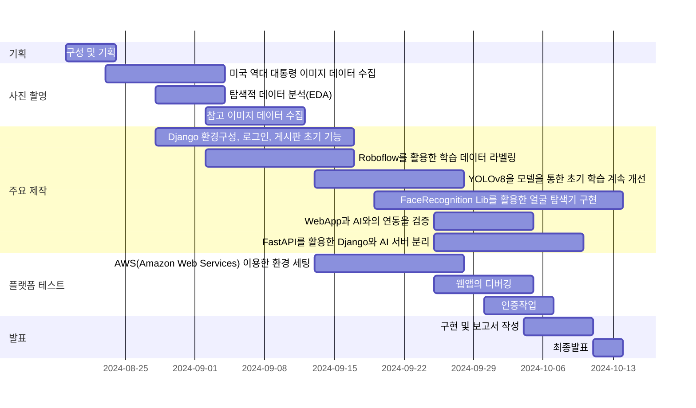

- 이미지는 샘플 이미지입니다.


## 5. 역할 분담

- 팀장 : 강유화
- 박상준
- 조하나
- 이예은


## 6. 와이어프레임 / UI / BM

### 6.1 와이어프레임

- 아래 페이지별 상세 설명, 더 큰 이미지로 하나하나씩 설명 필요
- 추후 추가 예정


### 6.2 화면 설계
- 화면은 gif파일로 업로드해주세요.
 
<table>
    <tbody>
        <tr>
            <td>메인</td>
            <td>로그인</td>
        </tr>
        <tr>
            <td>
      
            </td>
            <td>
                
            </td>
        </tr>
        <tr>
            <td>회원가입</td>
            <td></td>
        </tr>
        <tr>
            <td>
                
            </td>
            <td>
                
            </td>
        </tr>
        <tr>
            <td>검색</td>
            <td></td>
        </tr>
        <tr>
            <td>
                
            </td>
            <td>
                
            </td>
        </tr>
        <tr>
            <td></td>
            <td>글쓰기</td>
        </tr>
        <tr>
            <td>
           
            </td>
            <td>
                
            </td>
        </tr>
        <tr>
            <td>글 상세보기</td>
            <td>댓글</td>
        </tr>
        <tr>
            <td>
                
            </td>
            <td>
                
            </td>
        </tr>
    </tbody>
</table>


## 7. 데이터베이스 구조도(ERD)

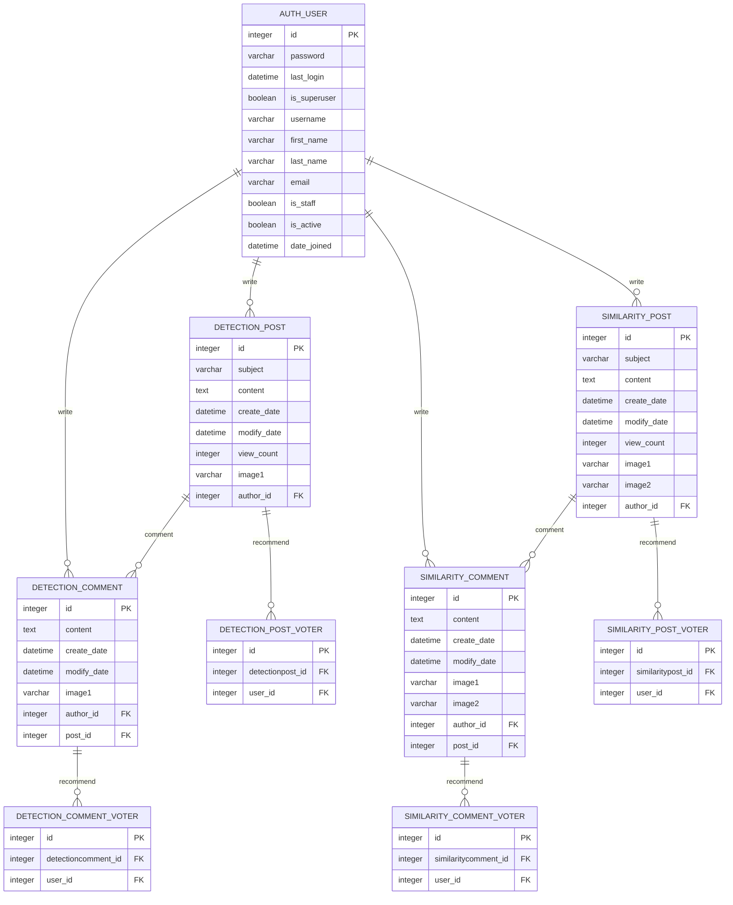


## 8. Architecture

- 시스템 설계

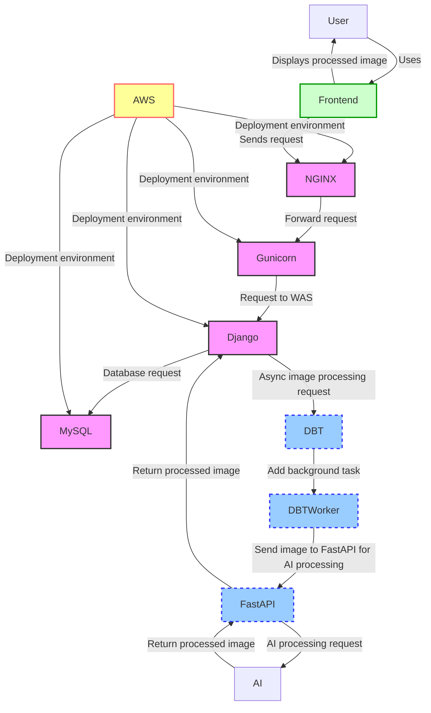

- 아래 Architecture 설계도는 PPT를 사용해서 작성
- 추후 추가 예정


- 이미지 기능 플로우 차트
  
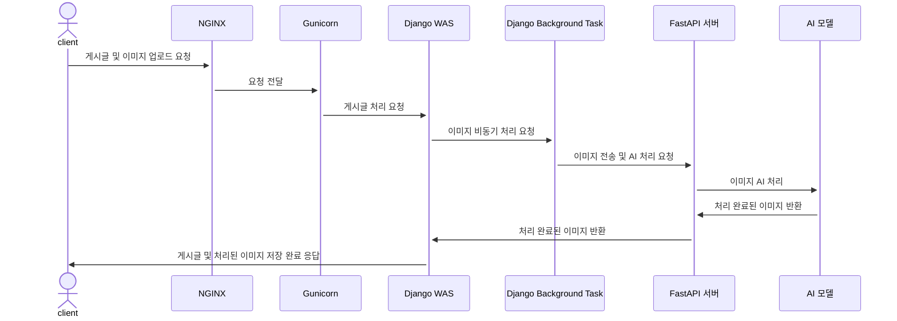

## 9. 주요 기능 설명

- 사용자가 웹페이지에 접속하면 메인 화면이 나오고, 사이드바에서 두 개의 게시판으로 이동하거나 로그인 또는 회원 가입을 할 수 있습니다.

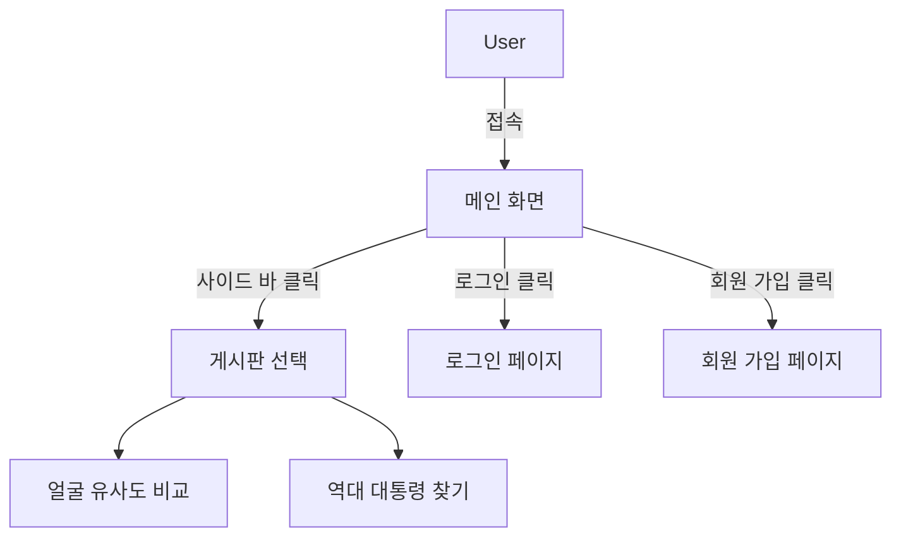

- 얼굴 유사도 비교 기능: 사용자가 두 명의 인물 사진을 업로드하면 유사도를 측정하여 정확도를 퍼센트로 표시합니다. 
사용자가 업로드한 사진 두 개를 비교해 AI가 얼굴 유사도를 분석하고, 결과를 댓글 형태로 제공합니다.

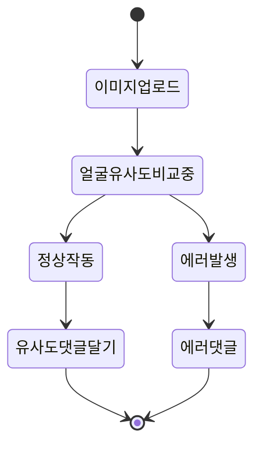

- 역대 대통령 찾기 기능: 사용자가 한 장의 이미지를 업로드하면 그 이미지에서 미국 역대 대통령이 있는지 탐색하고, 
관련된 정보글을 제공합니다. 대통령을 찾은 경우 바운딩박스를 표시하여 결과를 댓글 형태로 제공합니다.

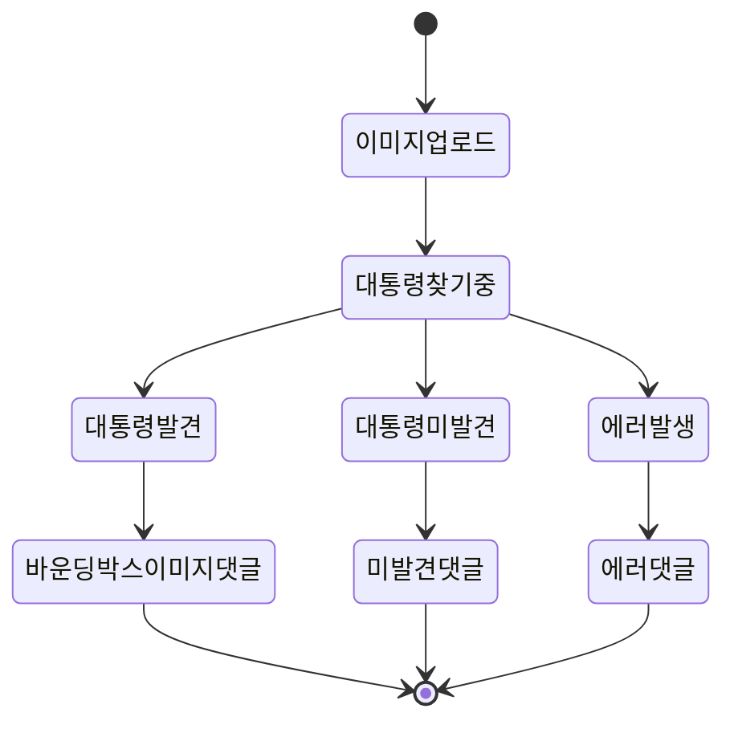

## 10. 클래스 다이어 그램

- Model.py

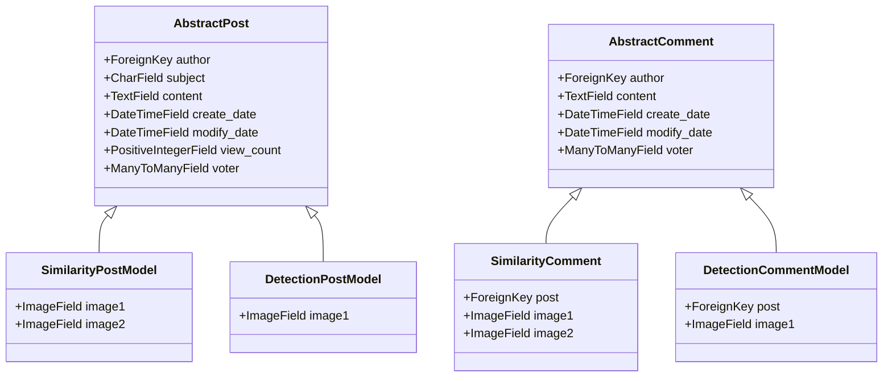

- base_views.py

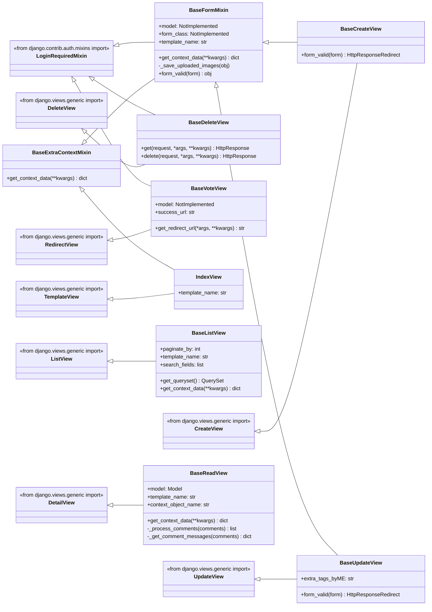

- similarity_post_views.py

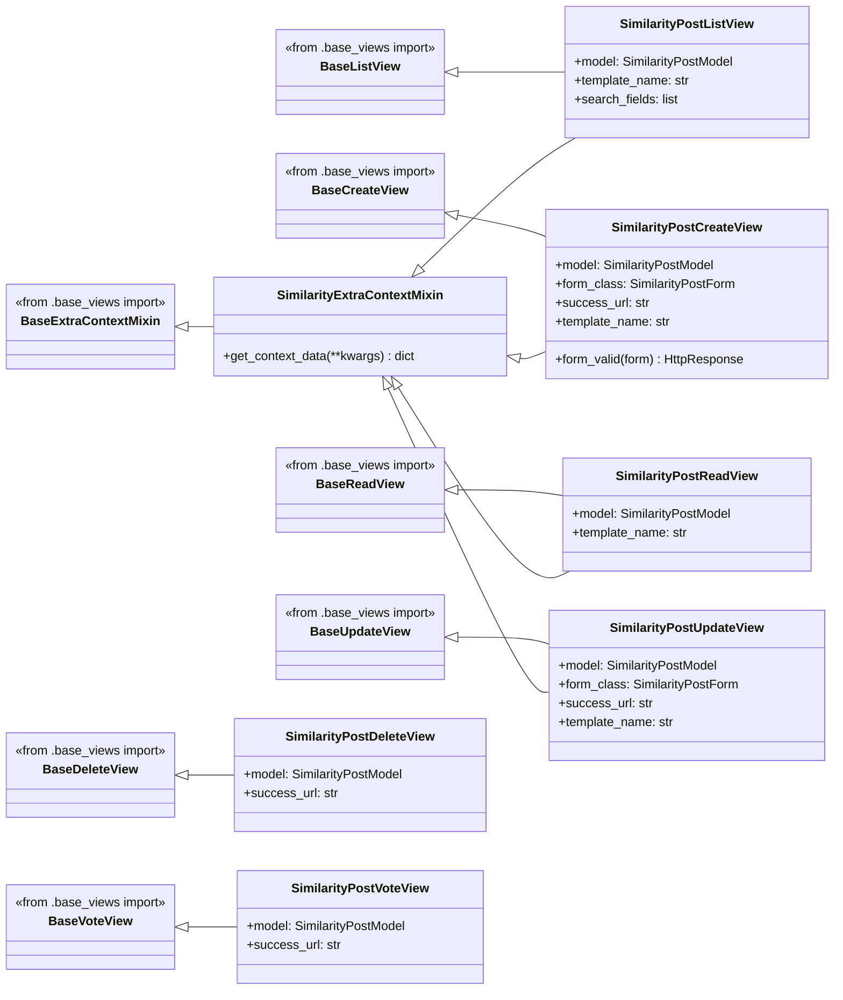

- similarity_comment_views.py

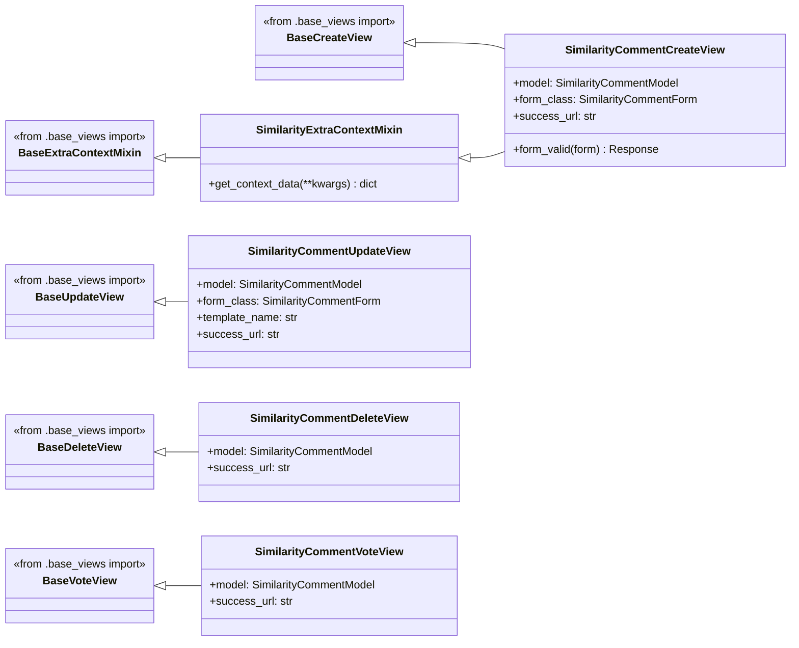

- detection_post_views.py

```mermaid
classDiagram
   direction LR  %% Left to Right 방향 설정

    BaseExtraContextMixin <|-- DetectionExtraContextMixin

    BaseListView <|-- DetectionPostListView
    BaseCreateView <|-- DetectionPostCreateView
    BaseReadView <|-- DetectionPostReadView
    BaseUpdateView <|-- DetectionPostUpdateView
    BaseDeleteView <|-- DetectionPostDeleteView
    BaseVoteView <|-- DetectionPostVoteView

    DetectionExtraContextMixin <|-- DetectionPostListView
    DetectionExtraContextMixin <|-- DetectionPostCreateView
    DetectionExtraContextMixin <|-- DetectionPostReadView
    DetectionExtraContextMixin <|-- DetectionPostUpdateView

    class BaseExtraContextMixin {
      <<from .base_views import>>
    }
    class BaseListView {
      <<from .base_views import>>
    }
    class BaseCreateView {
      <<from .base_views import>>
    }
    class BaseReadView {
      <<from .base_views import>>
    }
    class BaseUpdateView {
      <<from .base_views import>>
    }
    class BaseDeleteView {
      <<from .base_views import>>
    }
    class BaseVoteView {
      <<from .base_views import>>
    }
    class DetectionExtraContextMixin {
        +get_context_data(**kwargs) dict
    }
    class DetectionPostListView {
        +model: DetectionPostModel
        +template_name: str
        +search_fields: list
    }
    class DetectionPostReadView {
        +model: DetectionPostModel
        +template_name: str
    }
    class DetectionPostCreateView {
        +model: DetectionPostModel
        +form_class: DetectionPostForm
        +success_url: str
        +template_name: str
        +form_valid(form)
    }
    class DetectionPostUpdateView {
        +model: DetectionPostModel
        +form_class: DetectionPostForm
        +success_url: str
        +template_name: str
    }
    class DetectionPostDeleteView {
        +model: DetectionPostModel
        +success_url: str
    }
    class DetectionPostVoteView {
        +model: DetectionPostModel
        +success_url: str
    }
```

- detection_comment_views.py

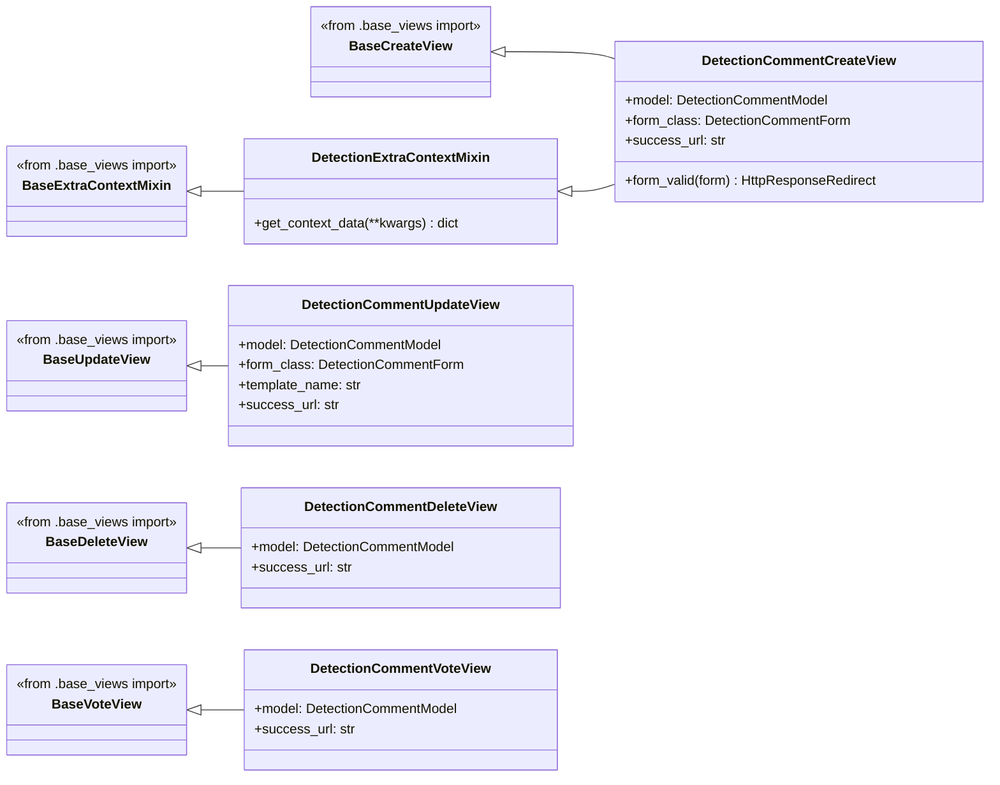

## 99. 에러와 에러 해결
1. Django 모델 업데이트 시 마이그레이션 에러

프로젝트 진행 중 Django 모델의 필드를 업데이트할 때 마이그레이션 에러가 발생했습니다. 특히 기존 필드를 삭제하거나 새로운 필드를 추가할 때 데이터베이스와 모델 간의 불일치가 원인이었습니다. 이를 해결하기 위해 makemigrations와 migrate 명령을 순차적으로 실행하고, 필드 삭제 시 데이터 손실을 방지하기 위해 먼저 필드를 nullable로 설정하는 등 유연한 접근을 시도했습니다. 또한, 데이터베이스 백업을 주기적으로 진행하여 데이터 손실 가능성에 대비했습니다.

2. AI 모델 학습 시 데이터셋 부족 및 구분하지 못하는 문제

특정 인물 탐지를 위한 AI 모델을 학습하는 과정에서 데이터셋의 부족과 유사한 얼굴 간의 구분 문제가 발생하였습니다. 특히, 두 인물이 부자관계로 인해 얼굴이 매우 유사하여 모델의 탐지 성능이 저하되는 어려움이 있었습니다. 이러한 문제를 해결하기 위해 다음과 같은 접근 방식을 적용하였습니다YOLOv8 전이 학습: 사전 학습된 YOLOv8 모델을 활용하여 전이 학습(Transfer Learning)을 적용함으로써 제한된 데이터셋에서도 높은 성능을 도출하고 학습 속도를 크게 향상시켰습니다. 전이 학습은 기존에 학습된 특성을 재사용하여 데이터셋 부족 문제를 효과적으로 완화할 수 있었습니다. 모델이 더 많은 다양한 상황에서 얼굴을 인식할 수 있도록, 회전, 크기 조정, 밝기 변화 등의 데이터 증강 기법을 적용하여 데이터의 다양성을 극대화했습니다. 이를 통해 데이터셋의 양적, 질적 향상을 도모하였습니다.데이터셋을 k-Fold 교차 검증 기법을 통해 다수의 부분으로 나누고, 각 Fold를 순차적으로 검증 데이터셋으로 활용함으로써 데이터셋의 효율적인 사용을 극대화하였습니다. 이를 통해 데이터셋의 부족 문제를 극복하고, 모델의 일반화 성능을 향상시킬 수 있었습니다.

3. URL 패턴, View, Template 연동 문제

View와 Template를 대부분 완성한 상태에서 URL 패턴을 변경하게 되면, View와 Template에서 관련된 URL을 일일이 수정해야 하는 문제가 발생했습니다. 프로젝트 규모가 커짐에 따라 이러한 작업이 비효율적이고 불필요한 시간 낭비라고 느꼈습니다.

이를 해결하기 위해 일관성 있는 URL 패턴을 지정하고, 이를 View와 Template에도 적용했습니다. URL 패턴을 하드코딩하는 대신, View의 제네릭 뷰 이름을 일관성 있게 변경하고 함수와 반복문을 통해 URL을 생성했습니다. 또한, 제네릭 뷰를 위한 기본(Base) 클래스를 만들어 Django에서 제공하는 제네릭 뷰와 커스텀 Base 뷰를 다중 상속하여 추가적인 뷰들을 효율적으로 생성할 수 있도록 했습니다. 클래스 설계 시 SOLID 원칙을 준수하여 유지보수가 용이하도록 하였으며, Template에서는 최대한 비즈니스 로직을 배제하고 렌더링에만 집중하도록 했습니다.

이 과정에서 Django의 get_context_data 메서드를 오버라이딩하여 사용자 정의 컨텍스트를 추가하고, Template에서 사용할 변수를 정의했습니다. 또한, Custom Template Tag를 정의하여 URL 패턴이 변경되더라도 Template에서는 변경할 필요가 없도록 하고, View에서 이를 능동적으로 처리하여 Template에 전달함으로써 Template 유지보수를 최소화했습니다.

4. Ubuntu 서버 환경에서 systemd service 파일 DBT 실행 문제

Django Background Task(DBT)를 실행하기 위해 시스템 부팅 시 자동으로 실행되도록 설정하고자 했습니다. 이를 위해 NGINX와 Gunicorn처럼 systemd service 파일을 작성하여 DBT를 실행하려 했으나, MySQL 데이터베이스에 접근하지 못하는 에러가 발생했습니다. 코드 상에는 문제가 없었지만, 원인은 Django의 설정과 환경 변수가 Django 서버가 실행된 이후에만 참조될 수 있기 때문이었습니다. Gunicorn service 파일이 conf.wsgi.py를 통해 Django 서버를 실행시킨 후에야 Django의 환경 변수를 참조할 수 있는데, DBT service 파일이 Gunicorn service 파일보다 먼저 실행되면서 이 문제가 발생한 것입니다. 이를 해결하기 위해 Gunicorn 서비스 파일에 python manage.py process_tasks & 명령을 추가하여 Gunicorn 서비스를 실행할 때 백그라운드에서 DBT가 실행될 수 있도록 설정했습니다. 이를 통해 Gunicorn이 Django 서버를 시작한 후에 DBT가 실행되도록 하여 문제를 해결할 수 있었습니다.

## 99. 개발하며 느낀점

이번 프로젝트는 Python, HTML/CSS/JS, Django, MySQL, AWS Lightsail, 그리고 GitHub를 활용하여 유명인물 영상 분석 및 Q&A 웹게시판 시스템을 구현한 경험이었습니다. 사용자가 업로드한 사진을 AI가 분석하여 자동으로 답글을 생성하는 기능을 통해 사용자들이 특정 인물의 사진을 게시판에 공유하고, 커뮤니티를 형성하는 것이 목표였습니다.

이 과정에서 Django 프레임워크의 MVT 패턴을 깊이 있게 학습하고, 이를 기반으로 클래스를 설계하여 웹 시스템을 구축했습니다. 클래스 설계 시 상속을 적극 활용하여 시스템 아키텍처를 체계적으로 개발할 수 있었으며, AI 시스템과 웹 시스템의 통합을 위해 외부 Python 파일을 모듈로 호출하는 기법을 적용했습니다.

프로젝트가 진행됨에 따라 시스템의 규모가 확대되면서, 단일 파이썬 파일로는 유지보수와 기능 확장에 한계가 있었습니다. 이를 해결하기 위해 약 1000줄에 달하는 AI 시스템 코드를 SOLID 원칙에 기반하여 클래스 설계를 재구성하고, 함수형 프로그래밍의 클로저 패턴을 적용하여 TensorFlow의 Sequential 클래스를 참고로 한 Pipeline 클래스를 구현함으로써 코드를 전체적으로 리팩토링했습니다. 또한, 소프트웨어 아키텍처의 토폴로지를 더 논리적으로 설계하여 모듈 간 의존성을 최소화하고 파일 및 디렉터리 구조를 최적화했습니다. 이러한 구조적 접근은 시스템 구성 요소들이 논리적이고 체계적으로 배열되도록 하여, 기능 확장 및 코드 리팩토링 시 전체 코드를 뒤집는 대신 각각의 모듈을 독립적으로 수정 및 추가할 수 있도록 만들어 협업을 용이하게 했습니다. 이를 통해 시스템의 확장성 및 유지보수에 클래스 설계와 파일 구조의 토폴로지가 미치는 중요성을 깊이 깨달았습니다.

협업 과정에서는 이전에 단순히 파일을 주고받거나 코드의 일부를 복사하여 붙여넣는 방식에서 벗어나 Git-flow 브랜치 전략을 채택하여 main, dev 브랜치와 각 기능별로 feature 브랜치를 생성해 사용했습니다. 코드는 GitHub 리포지토리를 통해 공유하고 병합하는 방식을 도입했습니다. 그러나 merge 과정에서 발생한 conflict를 경험하면서 CI/CD 파이프라인의 중요성과 코드 통합 전 linting 및 코드 리뷰 프로세스의 필요성을 깊이 깨달았습니다. 이 경험을 통해 CI/CD 파이프라인이 완전히 구축되고 디버깅 및 배포가 자동화된다면, 복잡한 Git-flow 전략보다는 GitHub-flow나 trunk-based 전략을 사용하는 것이 더 효율적일 것이라는 느낌을 받았습니다.

AWS Lightsail을 통한 배포 과정에서는 Ubuntu 환경에서 NGINX와 Gunicorn 등의 서버 환경 설정을 하면서 Linux 환경에서의 작업에 익숙해질 수 있었습니다. 이를 통해 Linux 시스템의 기본 명령어, 파일 권한 설정, 서비스 관리 등의 기술을 심도 있게 다룰 기회를 가질 수 있었습니다.

앞으로는 이번 프로젝트에서 배운 것들을 바탕으로 더 복잡한 시스템을 설계하고, 성능을 높일 수 있는 다양한 기술을 적용해 보고 싶습니다. 특히, 비동기 처리 및 실시간 데이터 처리와 관련된 기술을 더욱 깊이 있게 학습하여 대규모 시스템에서도 안정적이고 효율적인 서비스를 제공할 수 있는 개발자가 되고자 합니다.
