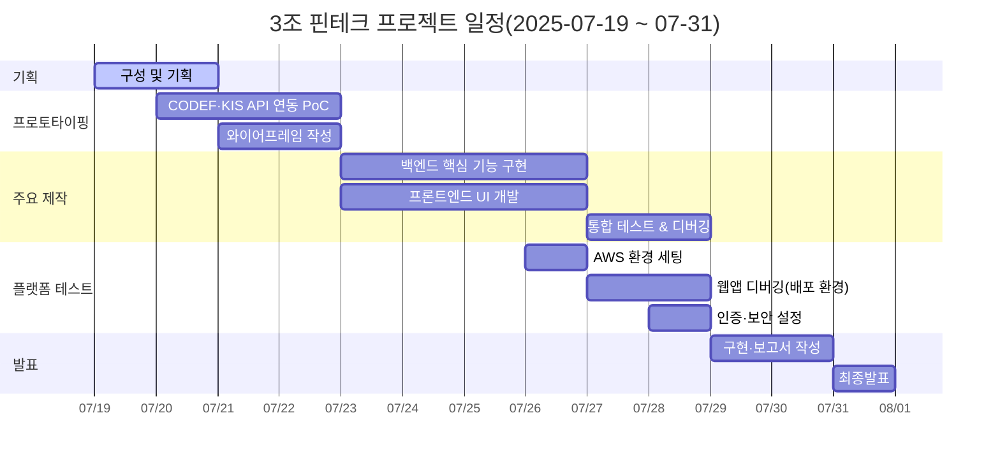

# 프로젝트 README

### 4.1 개발 일정(Gantt Chart)

## 5. 역할 분담
## 페이지 구성

1. **로그인 / 회원가입**  
   - 이메일·비밀번호 입력, 소셜 로그인(Naver/Kakao)  
   - 약관 동의, 비밀번호 재설정 링크  

2. **대시보드 (Dashboard)**  
   - 총 잔돈·예치 중 금액 요약  
   - 최근 투자 내역, 포트폴리오 요약 차트  
   - 주요 액션 버튼(계좌 연동, 투자 설정)  

3. **계좌 연동 (Account Linking)**  
   - 은행 선택 목록  
   - OAuth 로그인 흐름 시작  
   - 연동 현황 표시·해제 버튼  

4. **거래 내역 조회 (Transactions)**  
   - 기간별 입출금 내역 테이블  
   - 잔돈 계산 단위 설정(예: 1,000원 단위)  
   - 검색·필터(날짜, 금액 범위)  

5. **잔돈 투자 설정 (Investment Settings)**  
   - 적립 기준 금액 입력  
   - 투자 대상 ETF/펀드 선택  
   - 자동 투자 스케줄(매일·매주·매월) 지정  

6. **포트폴리오 / 투자 내역 (Portfolio)**  
   - 보유 자산 목록(종목별 수량·평가금액)  
   - 수익률 차트, 손익 현황  
   - 상세 매수·매도 기록  

7. **프로필 및 설정 (Profile & Settings)**  
   - 개인 정보 수정(이름, 비밀번호)  
   - 알림 설정(Push/Webhook)  
   - 계좌 연동 상태 확인·해제  

8. **알림 센터 (Notifications)** *(옵션)*  
   - 자동 투자 완료, 연동 오류, 잔돈 모자람 알림 기록  
   - 읽음 처리 및 상세 보기  

---

## 우선순위 제안

### 1차 프로토타입 (핵심 5개 페이지)
- 로그인 / 회원가입  
- 대시보드  
- 계좌 연동  
- 거래 내역 조회  
- 잔돈 투자 설정  

### 2차 확장 (추가 2~3개 페이지)
- 포트폴리오 / 투자 내역  
- 프로필 및 설정  
- 알림 센터  

---

## 개발 가이드라인
- **반응형 디자인**: 모바일/데스크톱 모두 지원  

---

## 다음 단계
1. 각 페이지 와이어프레임·UI 스케치 작성  
2. API 설계 및 목업 데이터 준비  
3. Frontend/Backend 기술 스택 확정  
4. 1차 프로토타입 개발 시작  

## 요구사항 명세와 기능 명세

**잔돈 ETF 자동 투자 플랫폼**  
React SPA (Front-end) + Spring Boot WebFlux (Back-end)

**개요**  
사용자 버튼 클릭과 매일 02:00 스케줄러를 통해 CODEF 거래내역 및 증권사 주문 상태를 폴링하여, 잔돈 적립·자동 투자·포트폴리오 조회 과정을 3초 이내로 완료합니다.

---

### 1. 로그인 · 회원가입

| Feature ID      | Method | Handler                | 설명                                                            |
|-----------------|--------|------------------------|-----------------------------------------------------------------|
| `/auth/signup`  | POST   | AuthSignupController   | 프로필 입력 후 사용자 레코드 생성                                |
| `/auth/login`   | POST   | AuthLoginController    | 소셜 로그인(OAuth2 PKCE: 네이버·카카오), JWT·Refresh Token 발급  |
| `/auth/logout`  | POST   | AuthLogoutController   | 서버 Refresh Token 폐기, 클라이언트 토큰 삭제                   |
| `/auth/refresh` | POST   | TokenRefreshController | Access Token 재발급 (Refresh Token 로테이션·블랙리스트)          |

---

### 2. 계좌 연동 및 거래내역 조회

| Feature ID                          | Method | Handler                         | 설명                                                        |
|-------------------------------------|--------|---------------------------------|-------------------------------------------------------------|
| `/account-link/connect`             | POST   | AccountLinkConnectController    | CODEF OAuth → access_token 획득 및 암호화 저장(RSA+AES)     |
| `/account-link/list`                | GET    | AccountLinkListController       | 연동된 은행/카드 계좌 목록 조회                            |
| `/account-link/disconnect/{id}`     | DELETE | AccountLinkDisconnectController | 특정 계좌 연동 해제, 토큰·암복호키 폐기                   |
| `/account-link/{id}/transactions`   | GET    | AccountTransactionController    | 선택한 계좌의 입출금 내역 조회 (기간 필터링 가능)           |
| `/account-link/fetch-transactions`  | POST   | TransactionsFetchController     | 버튼 클릭/스케줄러 → CODEF 거래내역 조회 → 이벤트 등록      |
| *(Cron)*                            | CRON   | CronTransactionFetchJob         | 매일 02:00 자동 실행: `/account-link/fetch-transactions` 호출 |

---

### 3. 잔돈 적립 (SpareChange)

| Feature ID                     | Method  | Handler                      | 설명                                                     |
|--------------------------------|---------|------------------------------|----------------------------------------------------------|
| `/spare-change/settings`       | GET/PUT | SpareChangeSettingController | 잔돈 계산 단위(N원) 및 투자 임계값 설정                  |
| `/spare-change/ledger`         | GET     | SpareChangeLedgerController  | 일별·거래별 잔돈 적립 내역 조회                         |
| *(Internal)* `LedgerService.add()` | –     | –                            | 거래내역 수신 → (결제금액 mod N) 계산 → 누적 후 임계값 도달 시 투자 호출 |

---

### 4. 자동 투자 실행 (Invest)

| Feature ID                                | Method | Handler                      | 설명                                                             |
|-------------------------------------------|--------|------------------------------|------------------------------------------------------------------|
| `/invest/orders/fetch`                    | POST   | KisOrderFetchController      | 버튼 클릭/스케줄러 → 증권사 체결 내역 조회 및 상태 업데이트       |
| `/invest/orders`                          | GET    | InvestOrderListController    | 사용자 ETF 주문·체결 내역 조회                                  |
| `/invest/orders/{id}`                     | GET    | InvestOrderDetailController  | 개별 주문 상세 조회(시장가·체결가·수수료·상태)                   |
| *(Cron)*                                  | CRON   | CronOrderFetchJob            | 매일 02:00 자동 실행: `/invest/orders/fetch` 호출               |
| *(Internal)* `InvestService.placeOrder()` | –      | –                            | 누적 잔돈 ≥ 임계값 → 한국투자증권 Open API 시장가 매수 (1/n 분할) |

---

### 5. 포트폴리오 조회 (Portfolio)

| Feature ID           | Method | Handler                     | 설명                                              |
|----------------------|--------|-----------------------------|---------------------------------------------------|
| `/portfolio/history` | GET    | PortfolioHistoryController  | 일자별 잔돈 투자 히스토리 그래프 조회             |
| `/portfolio/summary` | GET    | PortfolioSummaryController  | 보유 ETF 평가금액·수익률·누적 투자금·잔돈 총액 조회 |
| `/portfolio/export`  | GET    | PortfolioExportController   | 거래내역·수익률 CSV 다운로드                     |

---

### 6. 사용자 개인 설정 & 알림

| Feature ID            | Method  | Handler                    | 설명                         |
|-----------------------|---------|----------------------------|------------------------------|
| `/settings/profile`   | GET/PUT | ProfileController          | 닉네임·테마·타임존 설정      |
| `/settings/security`  | GET     | SecurityLogController      | 로그인 IP·디바이스 이력 조회 |
| `/notification/prefs` | GET/PUT | NotificationPrefController | 알림 설정(on/off), 채널 선택 |

---

### 7. 시스템 운영 (관리자 콘솔)

| Feature ID         | Method | Handler                     | 설명                               |
|--------------------|--------|-----------------------------|------------------------------------|
| `/admin/dashboard` | GET    | AdminDashboardController    | 가입자·API 모니터링(TPS·성공률)   |
| `/admin/users`     | GET    | AdminUserListController     | 사용자 검색·정지·계좌 재동기화     |
| `/admin/orders`    | GET    | AdminOrderListController    | 전체 주문·체결 기록 조회·장애 재처리 |
| `/admin/health`    | GET    | AdminHealthController       | API·DB·외부 연동 상태 헬스체크     |

---
